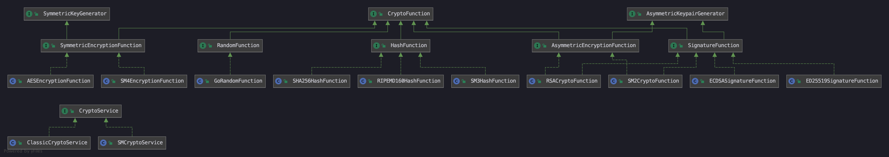

这是 JD Chain SDK 的 Go 语言实现版本的代码仓库，对应于 JD Chain Framework 中，Java 版本的 SDK 及其依赖的工程都相应地有一个 Go 语言的实现版本。

## Crypto

### Design 



`CryptoFunction`:
```go
type CryptoFunction interface {
	GetAlgorithm() CryptoAlgorithm
}
```

`SymmetricKeyGenerator`:
```go
type SymmetricKeyGenerator interface {
	GenerateSymmetricKey() SymmetricKey
}
```

`AsymmetricKeypairGenerator`:
```go
type AsymmetricKeypairGenerator interface {
	GenerateKeypair() AsymmetricKeypair
}
```

`SymmetricEncryptionFunction`:
```go
type SymmetricEncryptionFunction interface {
	SymmetricKeyGenerator
	CryptoFunction

	/**
	 * 加密；
	 *
	 * @param key 密钥；
	 * @param data 明文；
	 * @return
	 */
	Encrypt(key SymmetricKey, data []byte) Ciphertext

	/**
	 * 解密；
	 *
	 * @param key 密钥；
	 * @param ciphertext 密文；
	 * @return
	 */
	Decrypt(key SymmetricKey, ciphertext Ciphertext) []byte

	/**
	 * 校验对称密钥格式是否满足要求；
	 *
	 * @param symmetricKeyBytes 包含算法标识、密钥掩码和对称密钥的字节数组
	 * @return 是否满足指定算法的对称密钥格式
	 */
	SupportSymmetricKey(symmetricKeyBytes []byte) bool

	/**
	 * 将字节数组形式的密钥转换成SymmetricKey格式；
	 *
	 * @param symmetricKeyBytes 包含算法标识、密钥掩码和对称密钥的字节数组
	 * @return SymmetricKey形式的对称密钥
	 */
	ResolveSymmetricKey(symmetricKeyBytes []byte) SymmetricKey

	/**
	 * 校验密文格式是否满足要求；
	 *
	 * @param ciphertextBytes 包含算法标识和密文的字节数组
	 * @return 是否满足指定算法的密文格式
	 */
	SupportCiphertext(ciphertextBytes []byte) bool

	/**
	 * 将字节数组形式的密文转换成SymmetricCiphertext格式；
	 *
	 * @param ciphertextBytes 包含算法标识和密文的字节数组
	 * @return SymmetricCiphertext形式的签名摘要
	 */

	ResolveCiphertext(ciphertextBytes []byte) SymmetricCiphertext
}
```

`HashFunction`:
```go
type HashFunction interface {
	CryptoFunction

	/**
	 * 计算指定数据的 hash；
	 *
	 * @param data
	 * @return
	 */
	Hash(data []byte) HashDigest

	/**
	 * 校验 hash 摘要与指定的数据是否匹配；
	 *
	 * @param digest
	 * @param data
	 * @return
	 */
	Verify(digest HashDigest, data []byte) bool

	/**
	 * 校验字节数组形式的hash摘要的格式是否满足要求；
	 *
	 * @param digestBytes 包含算法标识和hash摘要的字节数组
	 * @return 是否满足指定算法的hash摘要格式
	 */
	SupportHashDigest(digestBytes []byte) bool

	/**
	 * 将字节数组形式的hash摘要转换成HashDigest格式；
	 *
	 * @param digestBytes 包含算法标识和hash摘要的字节数组
	 * @return HashDigest形式的hash摘要
	 */
	ResolveHashDigest(digestBytes []byte) HashDigest
}
```

`RandomFunction`:
```go
type RandomFunction interface {
	CryptoFunction

	Generate(seed []byte) RandomGenerator
}
```

`SignatureFunction`:
```go
type SignatureFunction interface {
	AsymmetricKeypairGenerator
	CryptoFunction

	/**
	 * 计算指定数据的 hash；
	 *
	 * @param data 被签名消息
	 * @return SignatureDigest形式的签名摘要
	 */
	Sign(privKey PrivKey, data []byte) SignatureDigest

	/**
	 * 校验签名摘要和数据是否一致；
	 *
	 * @param digest 待验证的签名摘要
	 * @param data 被签名信息
	 * @return 是否验证通过
	 */
	Verify(digest SignatureDigest, pubKey PubKey, data byte) bool

	/**
	 * 使用私钥恢复公钥；
	 *
	 * @param privKey PrivKey形式的私钥信息
	 * @return PubKey形式的公钥信息
	 */
	RetrievePubKey(privKey PrivKey) PubKey

	/**
	 * 校验私钥格式是否满足要求；
	 *
	 * @param privKeyBytes 包含算法标识、密钥掩码和私钥的字节数组
	 * @return 是否满足指定算法的私钥格式
	 */
	SupportPrivKey(privKeyBytes []byte) bool

	/**
	 * 将字节数组形式的私钥转换成PrivKey格式；
	 *
	 * @param privKeyBytes 包含算法标识、密钥掩码和私钥的字节数组
	 * @return PrivKey形式的私钥
	 */
	ResolvePrivKey(privKeyBytes []byte) PrivKey

	/**
	 * 校验公钥格式是否满足要求；
	 *
	 * @param pubKeyBytes 包含算法标识、密钥掩码和公钥的字节数组
	 * @return 是否满足指定算法的公钥格式
	 */
	SupportPubKey(pubKeyBytes []byte) bool

	/**
	 * 将字节数组形式的密钥转换成PubKey格式；
	 *
	 * @param pubKeyBytes 包含算法标识、密钥掩码和公钥的字节数组
	 * @return PubKey形式的公钥
	 */
	ResolvePubKey(pubKeyBytes []byte) PubKey

	/**
	 * 校验字节数组形式的签名摘要的格式是否满足要求；
	 *
	 * @param digestBytes 包含算法标识和签名摘要的字节数组
	 * @return 是否满足指定算法的签名摘要格式
	 */

	SupportDigest(digestBytes []byte)

	/**
	 * 将字节数组形式的签名摘要转换成SignatureDigest格式；
	 *
	 * @param digestBytes 包含算法标识和签名摘要的字节数组
	 * @return SignatureDigest形式的签名摘要
	 */
	ResolveDigest(digestBytes []byte) SignatureDigest
}
```

`AsymmetricEncryptionFunction`:
```go
type AsymmetricEncryptionFunction interface {
	AsymmetricKeypairGenerator
	CryptoFunction
}
```

### JD Chain Crypto

#### AES

`package`：`golang.org/x/crypto/aes`

`JD Chain`: `ECB PKCS7`

`Confirmed`: `true`


#### Base58

`package`: [shengdoushi/base58](#https://github.com/shengdoushi/base58)

`JD Chain`: `123456789ABCDEFGHJKLMNPQRSTUVWXYZabcdefghijkmnopqrstuvwxyz`

`Confirmed`: `true`


#### SHA256

`package`：`golang.org/x/crypto/sha256`

`JD Chain`: `SHA128=SHA256[:16]`

`Confirmed`: `true`


#### ED25519

`package`：`golang.org/x/crypto/ed25519`

`Confirmed`: `true`

> `JD Chain PrivKey` `32`位，`Go`中`64`位，低位为`PubKey`，签名和验签的时候需要注意


#### RSA

`package`：`golang.org/x/crypto/rsa`

`Confirmed`: `true`

> `PKCS1`, `SHA256`


#### ECDSA

`package`：[ThePiachu/Golang-Koblitz-elliptic-curve-DSA-library](#https://github.com/ThePiachu/Golang-Koblitz-elliptic-curve-DSA-library)

`Confirmed`: `true`

> `JD Chain` `PublicKey`的`getRawBytes`是`65`字节，较`Go`版本多了`0x04`


#### RIPEMD160

`package`：`golang.org/x/crypto/ripemd160`

`Confirmed`: `true`

> out piut size 20


#### SM2

`packahge`: [ZZMarquis/gm](#https://github.com/ZZMarquis/gm)/[tjfoc/gmsm](#https://github.com/tjfoc/gmsm)

`Confirmed`: `true`

> `JD Chain` `public key`会多一个`0x04`前缀
> `sign`/`verify`注意`uid`的问题


#### SM3

`packahge`: [ZZMarquis/gm](#https://github.com/ZZMarquis/gm)/[tjfoc/gmsm](#https://github.com/tjfoc/gmsm)

`Confirmed`: `true`


#### SM4

`packahge`: [ZZMarquis/gm](#https://github.com/ZZMarquis/gm)/[tjfoc/gmsm](#https://github.com/tjfoc/gmsm)

`Confirmed`: `true`

> `go`:`SM4/ECB/NoPadding`
> `JD Chain`:`SM4/CBC/PKCS7Padding`, [gmhelper](#https://github.com/ZZMarquis/gmhelper.git )

> [scloudrun/go-sm4](#https://github.com/scloudrun/go-sm4) 可作为解决方案：`JD Chain`加密结果会加上`16`字节的`iv`作为前缀，`Go`版本解密后去除前`16`个字节；`Go`版本的加密结果需要加上`iv`后`JD Chain`才能正确解密。